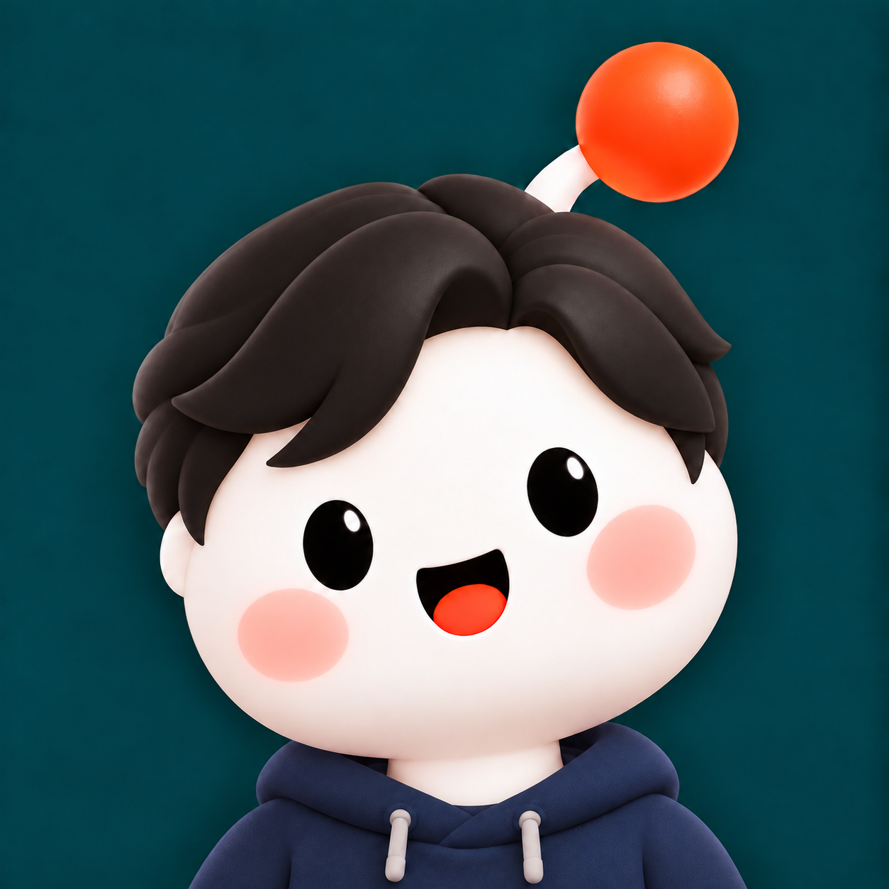

# Sortech-Infra

**말로 설명한 업무를, 실행 가능한 자동화로.**

Sortech-Infra는 AI 기반 업무 자동화 소프트웨어를 개발합니다.
대표 프로젝트 **SAPA**를 통해 업무를 설명하고, 실행 계획을 검토하고, 결과를 확인하는 흐름을 연결합니다.

## 대표 프로젝트 · SAPA

**SAPA · Sortech Agentic Process Automation**

자연어로 설명한 업무를 AI가 실행 계획으로 만들고, 웹·데스크톱·파일·외부 시스템 도구로 수행하는 기업용 업무 자동화 플랫폼입니다.

> 업무 설명 → 필요한 정보 확인 → 계획 검토 → 실행 → 결과 확인

### SAPA로 할 수 있는 일

- **대화로 업무 만들기** — 업무를 자연어로 설명하고, AI의 추가 질문에 답하며 실행 계획을 검토합니다.
- **여러 작업 환경 연결하기** — 브라우저와 데스크톱 작업, 엑셀·PDF·파일 처리, 외부 시스템 연동을 하나의 업무 흐름으로 구성합니다.
- **반복 업무 관리하기** — 재사용할 업무를 템플릿으로 저장하고, 반복 실행을 예약하며 진행 상태와 실행 이력을 확인합니다.
- **기록을 업무 설명으로 바꾸기** — 화면 녹화나 음성 녹음을 AI로 분석하고, 검토·수정한 내용을 새로운 업무의 출발점으로 사용합니다.

### 소티와 함께하는 업무

**소티**는 SAPA의 데스크톱 마스코트입니다.
다른 앱을 사용하는 동안에도 곁에 머물며, 클릭 한 번으로 간편 대화를 열고 맡긴 일과 확인할 일을 살펴볼 수 있습니다.

**[SAPA 저장소 →](https://github.com/Sortech-Infra/sapa)**

SAPA는 현재 비공개 저장소로 관리되며, 저장소 열람에는 접근 권한이 필요합니다.

## 함께 만드는 사람들

소티를 닮은 캐릭터로 Sortech-Infra의 멤버들을 소개합니다.

| 김주란 | 차지현 | 심관혁 |
| :---: | :---: | :---: |
|  |  |  |
| 파트장 | 사원 | 사원 |
| [@Ranna0323](https://github.com/Ranna0323) | [@chzeese1002-bot](https://github.com/chzeese1002-bot) | [@Gwan-Son](https://github.com/Gwan-Son) |
